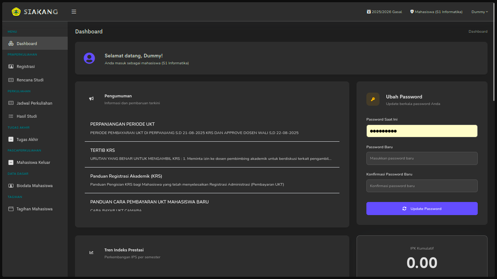

  <h1 align="center">Siakang Dark Mode</h1>
  

    A user script to bring a sleek dark theme and UI optimizations to Siakang Untirta.
  

  

    <a href="https://github.com/Bitodette/siakang-darkmode/issues">Report Bug</a>
    ·
    <a href="https://github.com/Bitodette/siakang-darkmode/issues">Request Feature</a>
  

  

    
    
    
    
  

---

## About The Project

**Siakang Dark Mode** is a Tampermonkey userscript designed to enhance the user experience on [Siakang Untirta](https://siakang.untirta.ac.id/) by applying a consistent dark theme and optimizing the user interface. This script aims to reduce eye strain during late-night study sessions and declutter the interface for better focus.

 ---

## Features

- **Comprehensive Dark Theme**: Applies a dark background to all major elements of the site.
- **Enhanced Readability**: Adjusts text and background colors for tables, navigation bars, sidebars, and other components to ensure clarity.
- **UI Declutter**: Hides non-essential menus and elements such as "System Setting," the "Change Language" option, and the profile picture in the navbar for a cleaner look.
- **Persistent Sidebar Preference**: Remembers your preferred sidebar size using local storage, so it stays the same on every page reload.

---

## Getting Started

To get a local copy up and running, follow these simple steps.

### Prerequisites

You need a user script manager browser extension. [Tampermonkey](https://tampermonkey.net/) is highly recommended.

- <a href="https://chrome.google.com/webstore/detail/tampermonkey/dhdgffkkebhmkfjojejmpbldmpobfkfo">Chrome</a>
- <a href="https://addons.mozilla.org/en-US/firefox/addon/tampermonkey/">Firefox</a>
- <a href="https://apps.apple.com/us/app/tampermonkey/id1482490089">Safari</a>
- <a href="https://microsoftedge.microsoft.com/addons/detail/tampermonkey/iikmkjmpaadaobahmlepeloendndfphd">Edge</a>

### Installation

1.  **Install the Userscript**
    - Click the "Install from GreasyFork" badge at the top of this README or visit the [script page on GreasyFork](https://greasyfork.org/en/scripts/544583-siakang-dark-mode).
    - Tampermonkey will open a new tab. Click the `Install` button.

2.  **Verify Installation**
    - The script should now be active. It is configured to run automatically on the `https://siakang.untirta.ac.id/*` domain.

3.  **Enjoy the New Look**
    - Navigate to or refresh your [Siakang Untirta](https://siakang.untirta.ac.id/) page to see the new dark mode in action!

---

## Important Notes

-   This script only modifies the appearance of the Siakang website on your browser (client-side). It **does not** alter any data on the Siakang server.
-   If you encounter any display issues or bugs, please report them by opening an issue on our [GitHub Issues](https://github.com/Bitodette/siakang-darkmode/issues) page.

---

## Contributing

Contributions are what make the open-source community such an amazing place to learn, inspire, and create. Any contributions you make are **greatly appreciated**.

If you have a suggestion that would make this better, please fork the repo and create a pull request. You can also simply open an issue with the tag "enhancement".

Don't forget to give the project a star! Thanks again!
